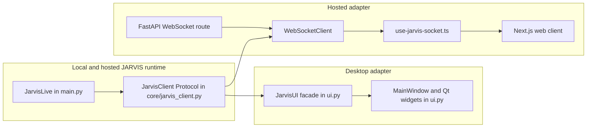

# JARVIS Architecture and F0 Baseline

Discovery snapshot: 2026-10-01, branch `origin/main` at `1a160ec`. This document records the executable repository state used before UI implementation. The local development worktree is based on that remote branch so existing changes in the user's separate clone remain untouched.

## System boundaries

### Runtime and client contract

`main.py` owns `JarvisLive`, Gemini Live session handling, audio flow, and tool dispatch. Its constructor accepts `client: JarvisClient`, stores that object as both `self.client` and the compatibility alias `self.ui`, and installs the text-command callback. `core/jarvis_client.py` defines the transport-neutral contract used by the desktop and hosted clients.

The protocol covers state, log, subtitle, theme, graphics quality, voice display, UI commands, mute, current file, and the voice selector. The runtime also uses optional client capabilities through `getattr` (including audio output and operational readiness); those capabilities are not declared in the current Protocol and need explicit review before any contract change.

### Desktop presentation adapter

`ui.py` currently contains 9,268 lines and 44 classes. `JarvisUI` is the public desktop adapter/facade; `MainWindow` owns most window composition, while widget and overlay classes share the same module. Qt signals dispatch state, log, transcript, progress, and command updates to the UI. The current compact mode is an 80×80 floating widget.

There is no `ui/` Python package yet. `main.py`, `awareness/engine.py`, the UI tests, and `scripts/qa_ui_probe.py` import names from `ui`; `pyproject.toml` lists `ui` as a Python module. `tests/test_phase1_decoupling.py` checks that `JarvisUI` still exposes the `JarvisClient` members. These imports are compatibility constraints for the package extraction.

### Hosted API and web presentation adapter

`api/server.py` authenticates hosted WebSocket sessions, creates `WebSocketClient`, and runs `JarvisLive` in cloud-safe/external-audio mode. The adapter translates client calls to the current JSON event vocabulary: `status`, `message`, `transcript`, `transcript_clear`, `preference`, `ui_command`, `progress`, `progress_end`, `progress_hide`, and `audio`. Its event queue is bounded at 256 entries and discards the oldest entry if full.

`web/src/hooks/use-jarvis-socket.ts` receives status, ready, message, transcript, audio, progress, and error events, and sends text, mute, and audio. It does not currently handle the adapter's `preference` or `ui_command` events. The WebSocket vocabulary is not the v1 envelope in `docs/ui/figma-spec.md`; a presentation mapper belongs in the adapters and must not add Gemini or action imports to the UI.

There is no structured `tool_call` event in the current UI client contract, no confirmed reconnecting/error state from the engine, no measured RTT, and no microphone/playback level event. The visible waveform is animation rather than measured audio. Until those signals are available, render unknown values as `—` and describe visual activity as “atividade”; do not change `main.py`, actions, API behavior, or prompt to manufacture missing telemetry.

## Mission snapshot verification

| Mission claim | Verified state in this snapshot |
|---|---|
| Python 3.11+, `main.py`/`ui.py` and public client protocol | Verified: Python minimum is 3.11; `main.py` is 2,145 lines and `ui.py` is 9,268 lines/44 classes; `JarvisClient` is in `core/jarvis_client.py`. |
| Desktop and web clients both exist | Verified: PyQt6 desktop is in `ui.py`; FastAPI and Next.js clients are in `api/` and `web/`. The TypeScript, TSX, and CSS sources under `web/src/` total 789 lines. |
| UI Figma specification is available | Verified on the selected `origin/main`: `docs/ui/figma-spec.md` exists. The spec's recognition section says it did not exist on 2026-09-29; that statement is historical after the spec PR merged. |
| Main UI module dimensions | Verified: `MainWindow` spans approximately lines 6578–9035; `HudCanvas` approximately 2110–3124; compact widget is 80×80. |
| Python package compatibility | Verified: `pyproject.toml` exports `main` and `ui` as top-level modules; compatibility tests import `JarvisUI` from `ui`. |
| Current tests and CI coverage | Verified: the full unittest discovery reports 269 tests across 16 modules, including 77 UI regression tests. Python CI runs only `test_phase1_decoupling`, `test_hosted_api`, and `test_core_resilience`; web CI runs `npm ci`, typecheck, lint, and build. Desktop regression tests are not in CI. |
| Theme/font baseline | Verified: `DESIGN.md` specifies the Arc Reactor palette, Space Grotesk and JetBrains Mono; both fonts and licenses are in `assets/fonts/`; `JARVIS.spec` bundles that directory. |
| Hosted protocol matches the proposed event envelope | Not verified: current event names/shapes differ from v1 and include no structured tool-call event. |
| Cross-platform behavior is proven by this run | Not verified: baseline ran on Linux only; Windows 11 and macOS were unavailable. |

Other verified documentation drift: `README.md` still gives the clone URL for `MAL19INDUSTRIES/JARVIS-OS-V.2`, while the selected repository is `anonymandk/jarvis`. `LICENSE` is MIT with copyright attributed to Abyz. Both are report-only in this mission; `LICENSE` will not be edited.

Dependency drift: most entries in `requirements.txt` have no version bound, and `web/package.json` declares its direct dependencies as `latest` despite a committed lockfile. `requirements.txt` contains both `google-genai` and `google-generativeai`; the automated audit found live imports of the legacy SDK in nine files. F6 will determine whether those call sites can be removed without changing behavior.

## F0 execution plan

**Goal:** improve the existing JARVIS presentation surfaces while retaining engine, tool, API, and prompt behavior.

1. **F0 — Discovery and baseline:** architecture map, decisions, complete Python QA, `jarvis --self-test`, and web baseline.
2. **F1 — CI safety net:** run the complete Python suite in offscreen mode with isolated development dependencies and cache.
3. **F2 — UI package extraction:** move `ui.py` by responsibility, preserve its import surface, packaging, QA scripts, and generated screenshots/equivalence evidence.
4. **F3 — Tokens and event adapter:** consolidate tokens, enforce contrast, and map existing client calls/events to v1 without engine changes.
5. **F4 — Desktop UI:** implement spec layout, states, accessibility, compact overlay behavior, and legacy settings migration.
6. **F5 — Web UI:** align web layout and event mapping with shared tokens, pin dependencies, and capture the same states.
7. **F6 — Existing-code quality:** make only in-scope, tested fixes; audit high-impact tools before proposing behavior changes; report license ownership mismatch.
8. **F7 — Documentation and final assurance:** update docs, run complete verification, capture evidence, and report remaining platform/live checks.

Each phase is isolated on its own local branch, committed after its gate, then the next phase branches from that commit. No branch is pushed by this local workflow.

## Baseline evidence

Environment: Linux, Python 3.11.16, Node 24.21.0. Python dependencies from `requirements.txt` were installed in the worktree-local `.venv`.

| Command | Result |
|---|---|
| `QT_QPA_PLATFORM=offscreen .venv/bin/python scripts/qa.py automated` | **3 passed, 2 failed**. Source compilation, dependency consistency, and secret scan passed. Full unittest and offscreen UI evidence failed. Report: `.qa-artifacts/20261001-164116/qa-report.md`. |
| Full QA-mode unittest discovery | **269 tests: 5 failures, 66 errors**. Errors mostly reference missing first-run-tour APIs (for example `FirstRunIntroOverlay`, intro cache/render helpers, and startup interaction gates); further test/UI mismatches are listed in the QA log. The five failures cover open-app normalization, default voice, graphics setting persistence, setup overlay centering, and generic system log filtering. Log: `.qa-artifacts/unittest-full.log`. |
| QA offscreen UI probe | **Failed** before capture because `ui.INTRO_SEQUENCE_VERSION` is absent. This prevents baseline screenshot collection through the current probe. |
| `.venv/bin/jarvis --self-test` | Direct entrypoint failed to import `scripts.self_test`; `scripts/` is not installed as a package. With `PYTHONPATH="$PWD" QT_QPA_PLATFORM=offscreen`, the self-test ran: **7 pass, 1 fail (SYSTEM)**, health 88%, with 4 supervised groups still required. Report: `.qa-artifacts/self-test-20261001T204055Z.json`. |
| Web baseline under Node 24.21.0 | `npm ci`, `npm run typecheck`, `npm run lint`, and `npm run build` all passed. Full output is preserved locally in `.qa-artifacts/web-baseline.log` (ignored, not committed). `npm ci` reported one install script not approved by the local npm policy; the production build still completed. |
| BlackPearl `CODE_ARCHAEOLOGY` launcher | **Unavailable as shipped here**: Node fails on a UTF-8 BOM at the shebang. Inspection also found Windows-only absolute paths in `dsh-team.js` and `dsh-delegate.js`. The role/skill files exist, but the configured DSH pipeline cannot run on this Linux installation without modifying its launcher/configuration. The discovery review therefore used read-only BlackPearl skill guidance and independent read-only agent inspection; no BlackPearl runtime files were changed. |

The QA audit also reported 469 broad `except Exception` handlers, legacy `google-generativeai` imports in nine runtime files, and 263 hex color literals in `ui.py`. These are findings for their scoped phases, not blanket permission for mass rewrites.
