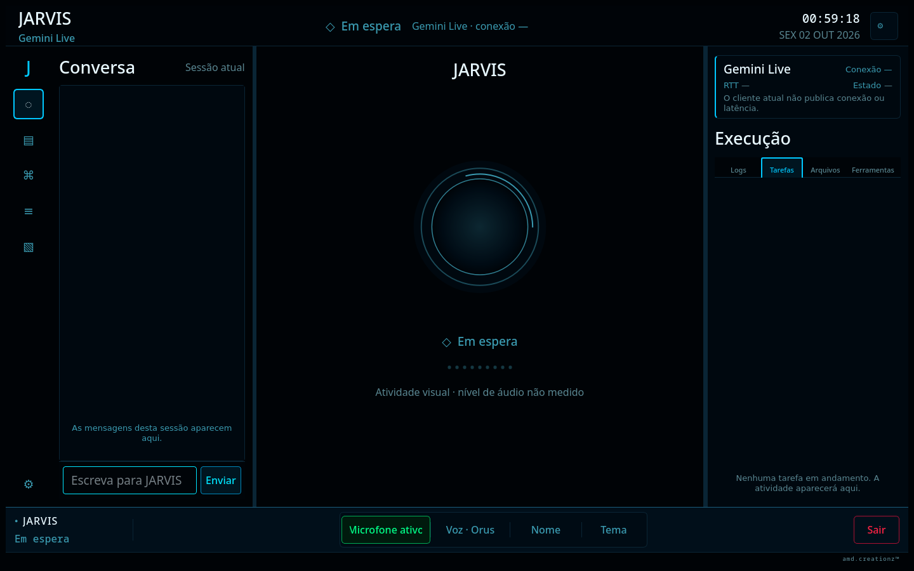
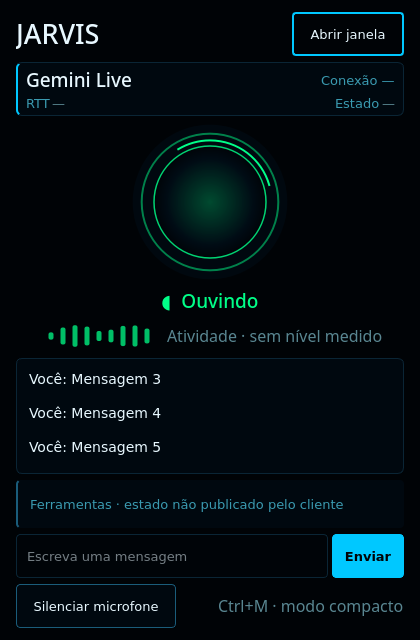

# F4 desktop UI evidence

Captured on Linux with PyQt6's offscreen platform by a direct run of `scripts/qa_ui_probe.py` for the F4 candidate. The probe uses isolated temporary settings and API-key paths. It does not read or alter the operator's real `~/.jarvis/config` files. The complete automated QA report for this code revision is `20261002-005901`; it records the full test suite and accessibility metrics.

The 29 captures cover the 1440×900 desktop, the 980×680 minimum desktop, populated conversation and logs, empty tools and files, all seven session labels, low/medium/high graphics profiles, reduced motion, all Settings pages, and the 420×640 compact window with the same seven session labels, three recent messages, and reduced motion.

## Desktop

- Empty workspace: [1440×900](screenshots/desktop/empty-1440x900.png)
- Minimum workspace: [980×680](screenshots/desktop/minimum-980x680.png)
- [Conversation populated](screenshots/desktop/conversation-populated.png) · [logs populated](screenshots/desktop/logs-populated.png) · [tools empty](screenshots/desktop/tools-empty.png) · [files empty](screenshots/desktop/files-empty.png)
- Session states: [idle](screenshots/desktop/state-idle.png) · [listening](screenshots/desktop/state-listening.png) · [processing](screenshots/desktop/state-processing.png) · [speaking](screenshots/desktop/state-speaking.png) · [reconnecting](screenshots/desktop/state-reconnecting.png) · [error](screenshots/desktop/state-error.png) · [muted](screenshots/desktop/state-muted.png)
- Graphics profiles: [low](screenshots/desktop/graphics-low.png) · [medium](screenshots/desktop/graphics-medium.png) · [high](screenshots/desktop/graphics-high.png)
- [Reduced motion](screenshots/desktop/motion-reduced.png)

## Compact window and Settings

- Compact window: [idle](screenshots/compact/state-idle-420x640.png) · [listening](screenshots/compact/state-listening-420x640.png) · [processing](screenshots/compact/state-processing-420x640.png) · [speaking](screenshots/compact/state-speaking-420x640.png) · [reconnecting](screenshots/compact/state-reconnecting-420x640.png) · [error](screenshots/compact/state-error-420x640.png) · [muted](screenshots/compact/state-muted-420x640.png)
- [Three recent messages](screenshots/compact/three-recent-messages-420x640.png) · [reduced motion](screenshots/compact/motion-reduced-420x640.png)
- Settings: [identity](screenshots/settings/identity.png) · [theme](screenshots/settings/theme.png) · [graphics and motion](screenshots/settings/graphics-and-motion.png)

The probe synthesizes the displayed session states so they can be captured consistently. In particular, reconnecting and connection-error captures are test fixtures, not evidence of a live Gemini reconnect. The current client does not publish measured RTT, tool-call state, or audio amplitude; those fields remain unavailable in the UI.

The probe's accessibility metrics report 0 visible controls without an accessible name, 0 buttons below 40×40 px, and 0 controls below 24×24 px across all 29 captures.
